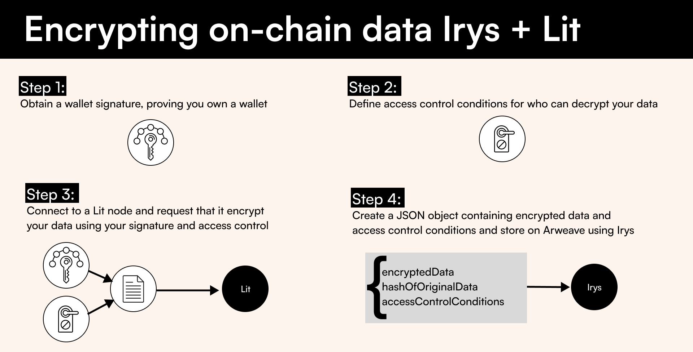
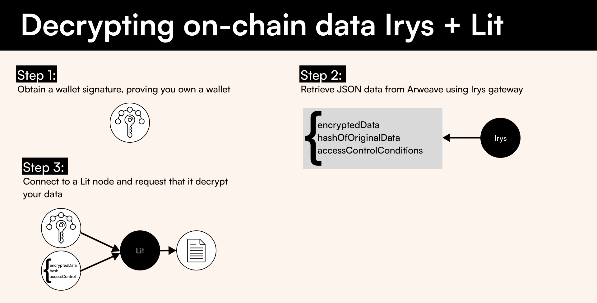

# Encrypting on-chain data

Data uploaded to Irys is stored permanently on Arweave. Once on Arweave, this data becomes publicly accessible, anyone can view or retrieve it. For projects where privacy is a concern, you can use [LitProtocol](https://litprotocol.com/) to encrypt data before storing it on Irys.

This repository teaches you how to:

-   Encrypt data before storing it on-chain
-   Establish a set of rules determining who can decrypt the data
-   Decrypt data

## Technology

-   [Irys](https://docs.irys.xyz/) for uploading data
-   [Lit v3](https://developer.litprotocol.com/v3/) for encrypting and decrypting data

## Encrypting data

There are three steps to encrypting data

-   Obtain a wallet signature ([AuthSig](https://developer.litprotocol.com/v3/sdk/authentication/overview#obtain-an-authsig)), which proves you own a wallet
-   Define [access control conditions](https://developer.litprotocol.com/v3/sdk/access-control/intro) for who can decrypt your data
-   Connect to a Lit node and request that it encrypt your data

Once encrypted, use Irys to store your data on Arweave.

## Decrypting data

There are three steps to decrypting data:

-   Obtain a wallet signature ([AuthSig](https://developer.litprotocol.com/v3/sdk/authentication/overview#obtain-an-authsig)), which proves you own a wallet
-   Retrieve data stored on Arweave via the Irys gateway
-   Connect to a Lit node and request it decrypt your data

## Docs

For a deeper dive, check out our docs:

-   [Encrypting on-chain data overview](http://docs.irys.xyz/hands-on/tutorials/encrypting-on-chain-data)
-   [Encrypting data server-side](http://docs.irys.xyz/hands-on/tutorials/server-side-encryption)
-   [Encrypting data in the browser](http://docs.irys.xyz/hands-on/tutorials/browser-based-encryption)

## Installation

1. Clone this repository
2. Rename `.env.example` to `.env` and add a private key
3. `cd irys-lit`
4. `yarn`

> Install with yarn only. There is currently a bug in the Lit Protocol npm install script, it will be fixed soon

## Running

1. `yarn dev`
